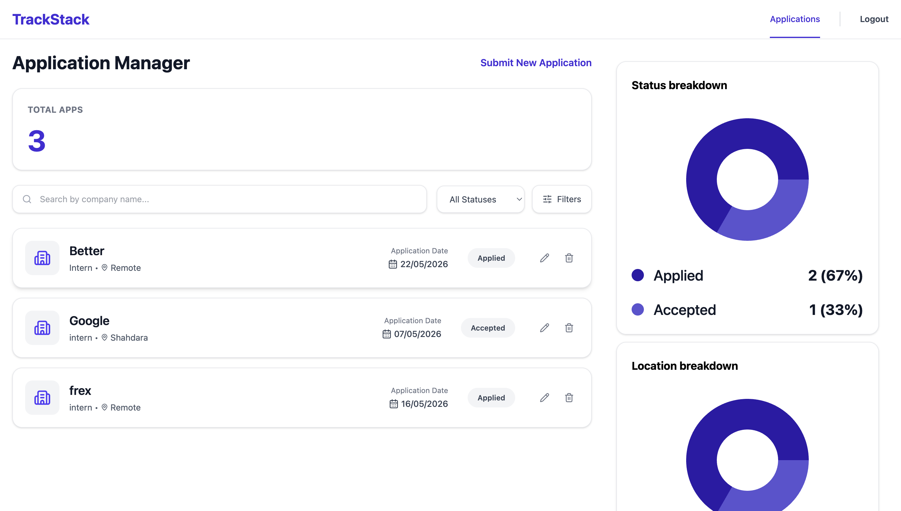
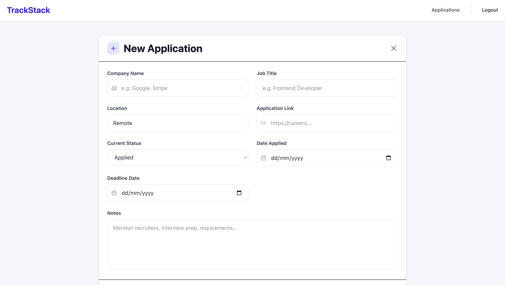
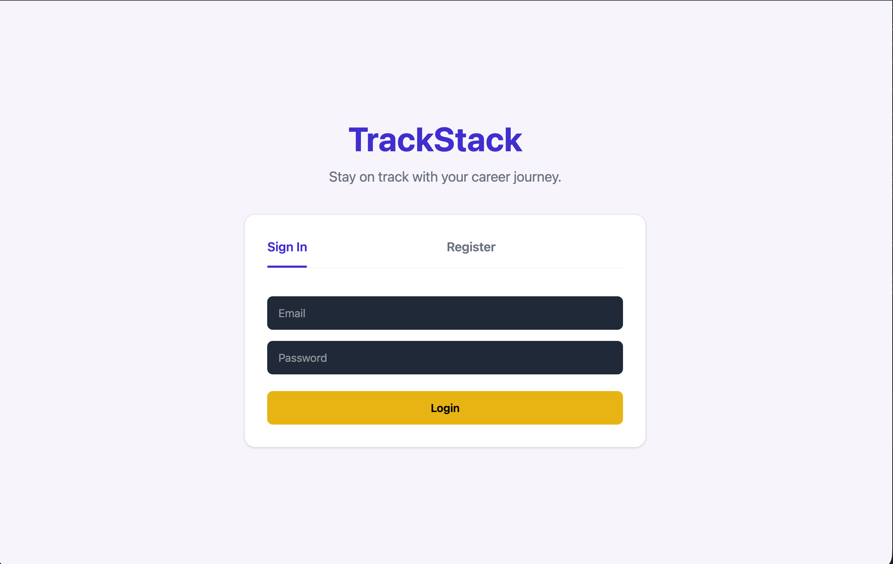

# TrackStack

TrackStack is a full-stack job application tracker built with React, Node.js, MongoDB, and Redis.

Users can:
- track job applications
- manage statuses
- visualize analytics
- search/filter applications instantly
- monitor application progress through dashboard charts

Built to practice production-style architecture including JWT authentication, REST APIs, Redis caching, rate limiting, Zod validation, and reusable React state management.

---

## Tech Stack

### Frontend
- React
- React Router
- Vite
- Axios
- CSS

### Backend
- Node.js
- Express.js
- MongoDB
- Mongoose
- Redis

### Authentication & Security
- JWT Authentication
- bcrypt password hashing
- express-rate-limit
- Zod validation

### Deployment
- Vercel (Frontend)
- Render / Railway (Backend)

---

## Features

- User authentication and authorization
- Create, update, and delete job applications
- Dashboard analytics and charts
- Search and filter applications instantly
- Inline application editing
- Responsive UI
- Redis caching for dashboard performance
- Rate limiting and validation middleware

---

## Folder Structure

```bash
src/
├── components/
├── pages/
├── services/
├── assets/
├── routes/
└── App.jsx
```

---

## Getting Started

### Prerequisites

- Node.js 18+
- TrackStack backend running on port 2005

### Installation

```bash
git clone https://github.com/ayushxx01/trackstack-client
cd trackstack-client
npm install
```

---

## Environment

Frontend currently uses a Vite proxy during development.

```js
// vite.config.js
proxy: {
  '/api': {
    target: 'http://localhost:2005',
    changeOrigin: true
  }
}
```

Production API URL is configured during deployment.

---

## Run

```bash
npm run dev
```

Frontend runs at:

```bash
http://localhost:2341
```

---

## Architecture

Frontend follows a component + service architecture:

- Pages handle screen-level state
- Components remain reusable and UI-focused
- All API communication is isolated in `services/`
- Protected routes use JWT authentication
- State updates happen optimistically after API success

Backend follows REST principles:

- Controllers handle request logic
- Middleware handles authentication and validation
- MongoDB stores application data
- Redis caches dashboard analytics

---

## Key Design Decisions

### Vite Proxy for API Calls

All `/api` requests are proxied to the Express backend during development, avoiding CORS configuration issues. In production, frontend and backend are deployed separately.

### Frontend Filtering

Applications are filtered directly in React state rather than querying the backend on every keystroke. Since applications are fetched once on mount, filtering remains instant with zero additional network requests.

### Inline Card Editing

Edit state lives inside `AppCard`, closest to where it is used. After saving, the updated application is passed upward through props to update the applications array in state, causing React to re-render only the affected card.

### Service Layer Separation

All API calls are isolated inside `services/`. Components never contain fetch logic directly, improving maintainability and separation of concerns.

### Token Storage

JWT tokens are stored in localStorage after authentication and attached automatically as `Authorization: Bearer` headers on protected requests.

---

## Pages

| Route | Page | Description |
|---|---|---|
| `/` | AuthPage | Login and register tab switcher |
| `/apps` | AppListPage | Applications list with filter and search |
| `/create` | CreateApp | Full-page application creation form |
| `/home` | AppPage | Dashboard with statistics and charts |

---

## Connected Backend

This frontend connects to the TrackStack REST API.

Backend Repository:
https://github.com/ayushxx01/trackstack

Backend handles:
- authentication
- application CRUD
- dashboard aggregation
- Redis caching
- rate limiting
- Zod validation

---

## Screenshots

### Dashboard


### Applications


### Authentication


---

## Demo

Frontend: Deployment in progress  
Backend API: Deployment in progress

---

## Future Improvements

- Refresh token rotation using httpOnly cookies
- Drag-and-drop Kanban board
- Deadline reminders and notifications
- Resume and cold-email management
- Server-side pagination and infinite scrolling
- CI/CD pipeline integration
- Unit and integration testing

---

## Author

Ayush Sharma

GitHub:
https://github.com/ayushxx01
